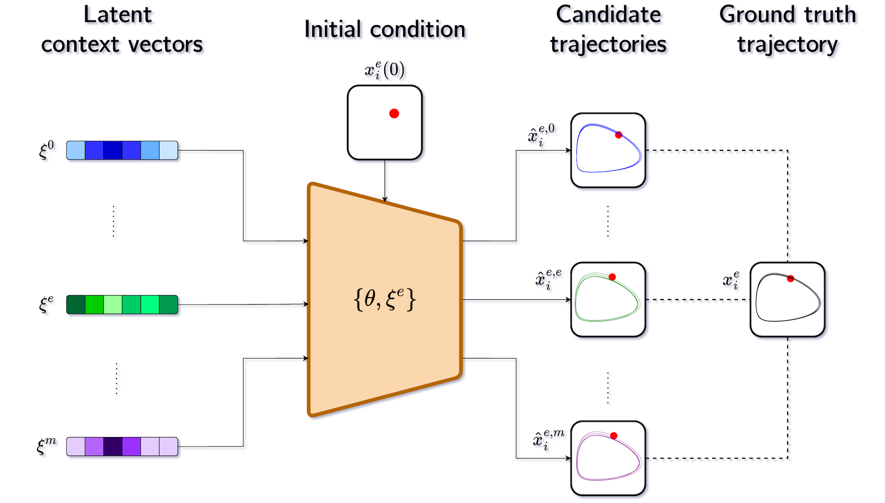

# Neural Context Flow

Official JAX implementation of [Neural Context Flows for Meta-Learning of Dynamical Systems](https://arxiv.org/abs/2405.02154), accepted at ICLR 2025. A PyTorch version is available [at this link](https://github.com/ddrous/ncflow-torch).

<p align="center">

</p>

## Overview
Neural Context Flow (NCF) is a framework for learning dynamical systems that can adapt to different environments/contexts, making it particularly valuable for scientific machine learning applications where the underlying system dynamics may vary across physical parameter values.

NCF is powered by the __contextual self-modulation__ regularization mechanism. This inductive bias performs Taylor expansion of the vector field about the context vectors, resulting in several candidate trajectories. While the training loss might be higher than that of the naive Neural ODE, we observe lower losses at adaptation time.

<p align="center">

</p>


The NCF package is built around 4 extensible modules: 
- a __DataLoader__: to load the dynamics datasets
- a __Learner__: a model, a context and the loss function
- a __Trainer__: the training and adaptation algorithms
- a __VisualTester__: to test and visualize the results

## Getting Started
To run of the experiments described in the NCF paper, follow the steps below:
1. Install the package: `pip install -e .`
2. Navigate to the problem of interest in the `examples` folder
3. (Optional) download the data from [Gen-Dynamics](https://github.com/ddrous/gen-dynamics) and place it in the `data` folder
4. Set its hyperparameters, and run the `main.py` script to both train and adapt the model to various environments. One can either run it in Notebook or script mode. We recommend using `nohup` to log the results: ```nohup python main.py > nohup.log &```
5. Once trained, move to the corresponding run folder saved in `runs`. Toggle the `train` flag in the `main.py` to `False`. Rerun `main.py` to perform additional experiments such as uncertainty estimation, interpretability, etc. 

## Notes
The main requirement to run our package is JAX and its ecosystem (Equinox, Diffrax, Optax). However, we require PyTorch (on the CPU platform) to generate data for the Navier-Stokes problem, as done in [CoDA](https://github.com/yuan-yin/CoDA).


## To-Do
- [ ] Provide links to some weights and contexts
- [ ] Delete long history of commits
- [ ] Test the installation in neutral conda environments

If you use this work, please cite the corresponding paper:
```
@inproceedings{
    nzoyem2025neural,
    title={Neural Context Flows for Meta-Learning of Dynamical Systems},
    author={Roussel Desmond Nzoyem and David A.W. Barton and Tom Deakin},
    booktitle={The Thirteenth International Conference on Learning Representations},
    year={2025},
    url={https://openreview.net/forum?id=8vzMLo8LDN}
}
```
